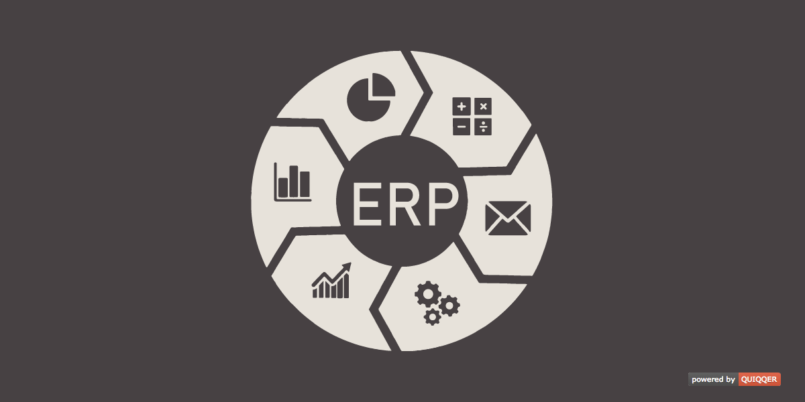

QUIQQER ERP
========

The QUIQQER ERP module bundles all QUIQQER modules which you need for a 
ERP (Enterprise Resource Planning) system. 

It is your central point to successfully realize your project.
The ERP system transforms QUIQQER into a fully-fledged e-commerce shop or into your invoice management. 
Start your e-business now.

Package name:

    quiqqer/erp

You can implement the following projects with the ERP module:
------

- E-Commerce Shop System
- Single-use product management
- Single-use invoice management
- Single-use employee administration
- Single-use customer management
- Single-use offer system

The ERP system consists of the following modules
------

- QUIQQER Areas
- QUIQQER Currency
- QUIQQER Discount
- QUIQQER Products
- QUIQQER TAX
- QUIQQER Invoice
- QUIQQER Order
- QUIQQER Employee
- QUIQQER Customer
- QUIQQER Payments 
    - Standard payment methods: Invoice, Cache, Advanced payment
    - QUIQQER Amazon
    - QUIQQER Paymill
    - QUIQQER Paypal
- QUIQQER Watchlist
- QUIQQER Payment Transactions
- QUIQQER Memberships

The following modules are under development:
------

- QUIQQER Warehouse Management

Contribution
----------

- Issue Tracker: https://dev.quiqqer.com/quiqqer/erp/issues
- Source Code: https://dev.quiqqer.com/quiqqer/erp/tree/master

Support
-------

If you have found an error or want improvements, please send an e-mail to support@pcsg.de.

LICENCE
-------

- GPL-3.0+
- PCSG QEL-1.0